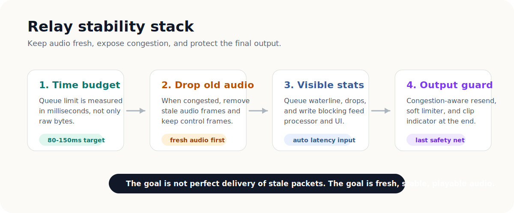

# CookieLinkRelay

<h1 align="center">CookieLinkRelay</h1>

<p align="center">
  CookieLink 的独立 TCP Relay / AOO UDP server 仓库。
</p>

<p align="center">
  
</p>

## 它负责什么

CookieLinkRelay 是 CookieLink 在直连不稳定、NAT 复杂或需要固定服务器入口时的中继服务。它和主 App 仓库拆开，方便你把客户端和服务器分别上传 GitHub、分别部署、分别发布。

默认服务：

| 服务 | 默认端口 | 说明 |
| --- | --- | --- |
| TCP Relay | `11000` | CookieLink relay 音频/控制转发 |
| AOO UDP server | `10998` | AOO 发现/组会话辅助服务，可用 `--no-udp` 关闭 |

## 快速构建

```sh
cmake -S . -B build -DCMAKE_BUILD_TYPE=Debug
cmake --build build --target CookieLinkRelay -j2
```

生成位置：

```text
build/CookieLinkRelay_artefacts/Debug/CookieLinkRelay
```

## 运行示例

```sh
./build/CookieLinkRelay_artefacts/Debug/CookieLinkRelay --port 11000 --udp-port 10998 --max-queue-ms 120 --stats-interval 1000
```

常用参数：

```text
--port <tcp_port>
--udp-port <aoo_port>
--no-udp
--auth-token <token>
--auth-file <path>
--tls-cert <path> --tls-key <path> [--tls-ca <path>]
--send-buf <bytes>
--recv-buf <bytes>
--write-timeout <ms>
--max-queue-ms <ms>
--max-queue <bytes>
--stats-interval <ms>
--debug
--log-frames
--log-data
```

## 稳定性设计

- 队列上限优先用时间预算表达，默认 `120ms`。
- 超过预算时丢旧音频帧，保留控制帧。
- 统计输出包括队列水位、丢帧数和写阻塞耗时，便于客户端 UI 和自动延迟判断。
- TCP relay 下的 resend 做拥塞感知，避免坏网络时重发进一步加重排队。
- TLS 为可选能力，启用时需要以 `COOKIELINK_RELAY_ENABLE_TLS=ON` 配置并提供 OpenSSL。

## 仓库内容

```text
CookieLinkRelay/
  CMakeLists.txt
  server/TcpRelayServer.cpp
  Source/RelayProtocol.h
  deps/juce/
  deps/aoo/
```

已排除主 App、插件资源、旧 `aooserver-master`、构建产物、AAX SDK、本地发布文档和工作记忆。

## License

本项目按 `LICENSE` 和 `LICENSE_EXCEPTION` 中的条款发布。第三方依赖按各自许可证发布。
